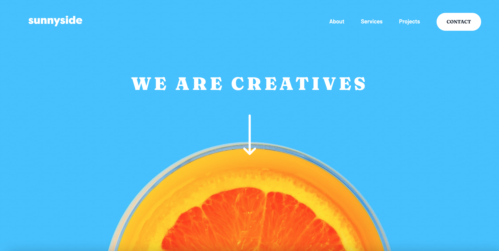

# Sunnyside-Agency-Website

## Table of contents

- [Overview](#overview)
  - [The challenge](#the-challenge)
  - [Screenshot](#screenshot)
  - [Links](#links)
- [My process](#my-process)
  - [Built with](#built-with)
- [Author](#author)
- [Acknowledgments](#acknowledgments)

## Overview

Website for Sunnyside Creative Agency.

### The challenge

Users should be able to:

- View the optimal layout for the site depending on their device's screen size
- See hover states for all interactive elements on the page

### Screenshot

### Links

- Solution URL: [Follow this link](https://www.frontendmentor.io/solutions/sunnyside-creative-agency-landing-page-nqqAl377Pq)
- Live Site URL: [Follow this link](https://rodrigodelascio.github.io/Sunnyside-Agency-Website/)

## My process

### Built with

- HTML
- CSS custom properties
- JavaScript
- Flexbox
- Mobile-first workflow

## Author

- Website - [Rodrigo de Lascio](https://rodrigodelascio.tech/)
- Frontend Mentor - [@rodrigodelascio](https://www.frontendmentor.io/profile/rodrigodelascio)
- GitHub - [@rodrigodelascio](https://github.com/rodrigodelascio)
- LinkedIn - [@rodrigodelascio](https://www.linkedin.com/in/rodrigo-de-lascio/)
